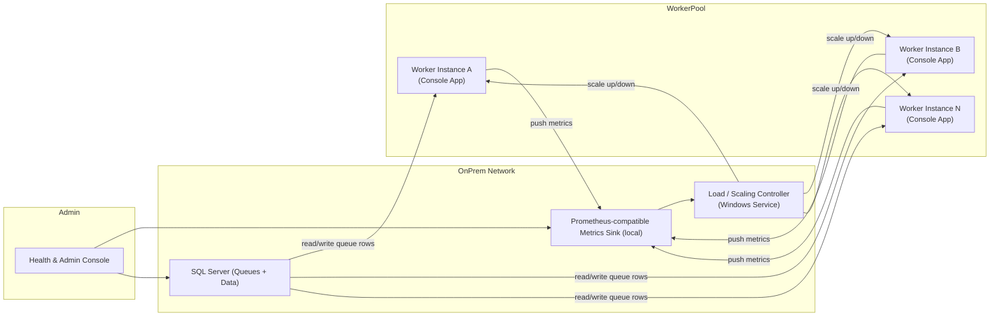

# Architecture & Design

## High-level architecture (Mermaid)


```

## Components
- Coordinator / Scaling Controller: local Windows service monitoring metrics + SQL queue depth and controlling number of worker instances (start/stop processes or services). Must respect 2 GB per instance constraint.
- Worker (Console App): single-purpose console worker implementing graceful shutdown, health endpoints, metrics, retry policies and SQL-based queue client.
- SQL Server: primary datastore and queue tables (local/private network instance).
- Metrics sink: local Prometheus-compatible endpoint or push-gateway replacement for on-prem metrics collection.
- Health & Admin Console: UI/CLI to view health, queue depth, and trigger scaling.

## Key classes & interfaces (summary)
- `IWorker` — start/stop processing loop, graceful shutdown token.
- `IQueueClient` — DequeueAsync, AckAsync, NackAsync, PeekDepthAsync.
- `IRetryPolicy` — ExecuteAsync(Func<Task>), configurable backoff.
- `WorkerBase` — base implementation: metrics, logging, health checks, queue handling loop.
- `ScalingController` — evaluates metrics and queue depth to scale worker count.
- `HealthController` — exposes `/health` and `/metrics` endpoints (HTTP listener).

## Configuration Approach
- Centralized appsettings.json (per-worker) with environment overrides.
- Explicit sections: `Sql`, `Queue`, `Metrics`, `Logging`, `Scaling`, `RetryPolicy`, `Health`.
- Use secure local store for secrets (Windows DPAPI / Local Windows Credential Store).

## Sample implementation notes
- Workers are built as .NET Core console apps targeting Windows (Windows Server 2019+).
- Use `System.Threading.Channels` or manual polling from SQL queue table with row locking (READPAST, UPDLOCK patterns).
- Expose health on a short-lived HTTP listener (e.g., Kestrel minimal host) to return liveness/readiness and metrics.
- Metrics should be Prometheus-format text at `/metrics`.
- Scaling Controller can be a Windows Service that starts/stops worker processes using ServiceController or Task Scheduler.

## Performance targets
- Target per-instance memory <= 2 GB; limit concurrency per worker accordingly.
- Queue polling interval and batch size tuned to keep latency < X seconds (configurable per workload).

(See SPECIFICATIONS.md for DB schema and performance numbers.)
